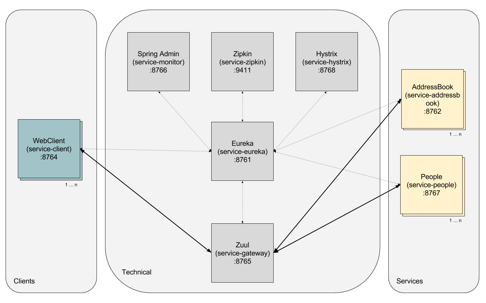

# Spring Features

## Overview
This proof of concept includes 8 micro services. Each of it represents an Java Spring feature. This document helps 
you to get an overview of the project and a guide.

The repository contains the following micro services.

* Service Addressbook
* Service People
* Service Client
* [Service Eureka](https://cloud.spring.io/spring-cloud-netflix)
* [Service Gateway (Zuul)](https://spring.io/guides/gs/routing-and-filtering)
* [Service Hystrix](https://spring.io/guides/gs/circuit-breaker)
* [Service Monitor (Spring Admin)](https://github.com/codecentric/spring-boot-admin)
* [Service Zipkin](https://cloud.spring.io/spring-cloud-sleuth/spring-cloud-sleuth.html)

## Architecture
The following picture is summarizing the architecture of the project.



## Preparation
Please install the following tools on your local machine:
* Java JDK 11 ([https://www.java.com/de/download/help/download_options.xml](https://www.java.com/de/download/help/download_options.xml))
* The newest version of git ([https://git-scm.com](https://git-scm.com))
* The newest version of maven ([https://maven.apache.org](https://maven.apache.org))

## Starting
There are two ways to start this spring feature poc:
* manual via maven
* automatically via maven

### Manual via maven
After cloning the complete repository to your local computer, change to the subfolder and start each micro service with
maven:
```
mvn -DDOCKER_MACHINE_IP=127.0.0.1 -DEUREKA_PORT=8761 -DZIPKIN_PORT=9411 spring-boot:run
```
Please be sure to start the services in this order:
1. service-eureka
2. service-addressbook
3. service-people
4. service-client

### Automatically via maven
To start all services via the shell-script, type the following command:
```
.\build_local.sh
```

## Description of each micro services

### Service Addressbook (:8762)
The Addressbook service creates an address book with people in it. The amount of people can be defined as an url 
parameter (e.g. 10).  The service gets all the people from the service "service-people".

There are two possibilities to get an address book. The endpoint "getAddressbookMultiple" calls the service-people once 
to get all the people. The endpoint "getAddressbookSingle" calls the service-people multiple times. 

#### Endpoints
* Service-Request: [http://127.0.0.1:8762/getAddressbookMultiple/10](http://127.0.0.1:8762/getAddressbookMultiple/10)
* Service-Request: [http://127.0.0.1:8762/getAddressbookSingle/10](http://127.0.0.1:8762/getAddressbookSingle/10)
* Info: [http://127.0.0.1:8762/info](http://127.0.0.1:8762/info)
* Swagger-Doku: [http://127.0.0.1:8762/swagger-ui.html](http://127.0.0.1:8762/swagger-ui.html)
* Swagger-JSON: [http://127.0.0.1:8762/v2/api-docs](http://127.0.0.1:8762/v2/api-docs)

### Service People (:8767)
This service creates people. The amount of people can be defined as a url parameter (e.g. 10). The service generates 
random names and details.

#### Endpoints
* Service-Request: [http://127.0.0.1:8767/getPeopleMultiple/10](http://127.0.0.1:8767/getPeopleMultiple/10)
* Service-Request: [http://127.0.0.1:8767/getPeopleSingle](http://127.0.0.1:8767/getPeopleSingle)
* Info: [http://127.0.0.1:8767/info](http://127.0.0.1:8767/info)
* Swagger-Doku: [http://127.0.0.1:8767/swagger-ui.html](http://127.0.0.1:8767/swagger-ui.html)
* Swagger-JSON: [http://127.0.0.1:8762/v2/api-docs](http://127.0.0.1:8762/v2/api-docs)

### Service Client (:8764)
This service creates an HTML/AngularJS web page. There it is possible to see the service url from the address book 
service and requests an specific amount of people.

#### Endpoints
* Service-Request: [http://127.0.0.1:8764](http://127.0.0.1:8764)
* Info: [http://127.0.0.1:8764/info](http://127.0.0.1:8764/info)

### Service Eureka (:8761)
This service starts an eureka server. With this you can manage and see all available services.

#### Endpoints
* Service-Request: [http://127.0.0.1:8761](http://127.0.0.1:8761)
* Info: [http://127.0.0.1:8761/info](http://127.0.0.1:8761/info)

### Service Gateway (:8765)
This service starts an Spring Zuul server. With this you can use load balancing and proxy requests in the project.

#### Endpoints
* Service-Request: [http://127.0.0.1:8765](http://127.0.0.1:8765)
* Info: [http://127.0.0.1:8765/info](http://127.0.0.1:8765/info)

### Service Hystrix (:8768)
This service starts an Spring Hystrix dashboard which can visualize the turbine or hystrix streams.

#### Endpoints
* Service-Request: [http://127.0.0.1:8768/hystrix](http://127.0.0.1:8768/hystrix)
* Info: [http://127.0.0.1:8768/info](http://127.0.0.1:8768/info)
* Hystrix-Stream: [http://127.0.0.1:8768/turbine.stream](http://127.0.0.1:8768/turbine.stream)

### Service Monitor (:8766)
This service starts an Spring Boot Admin server. With this you can have an detailed view for each micro service. Its also
possible to see all calls, logging or version details. Also an ram usage is available.

#### Endpoints
* Service-Request: [http://127.0.0.1:8766](http://127.0.0.1:8766)
* Info: [http://127.0.0.1:8766/info](http://127.0.0.1:8766/info)

### Service Zipkin (:9411)
This service starts an Spring Zipkin server. With this you can trace all requests from each micro service.

#### Endpoints
* Service-Request: [http://127.0.0.1:9411](http://127.0.0.1:9411)
* Info: [http://127.0.0.1:9411/info](http://127.0.0.1:9411/info)

## Deploy to IBM Cloud
With the following button you can deplo the poc to the IBM Cloud.

[](https://bluemix.net/deploy?repository=https://github.com/IBM/spring-features.git)